# 凱文大叔課程檔期板規格書

## 1. 架構與選型

- 前端：`Vite + TypeScript + 原生 CSS`
- 部署：`GitHub Pages`
- 內容輸入：`GitHub Issue Forms`、`course/<課程目錄>/課程 markdown`
- 自動化：`GitHub Actions`
- 專案技能：`skills/course-issue-publisher`
- 資料來源：GitHub Issue 經驗證後轉為靜態 `JSON`
- 時區：`Asia/Taipei`

選型理由：
- 靜態站適合 GitHub Pages，部署成本最低。
- Issue Forms 可降低手動輸入錯誤，適合非技術維護者。
- GitHub Actions 可串接驗證、資料轉換與自動部署。
- 專案技能搭配本地腳本，可從 `course` 目錄讀取課程 markdown、圖片與發布紀錄，直接發布 Issue 並確認上站結果。
- 前端不引入大型 UI 框架，維持 GitHub Pages 輕量與可維護性。

## 2. 資料模型

### 2.1 Course

| 欄位 | 型別 | 必填 | 說明 |
| --- | --- | --- | --- |
| id | string | 是 | 以 issue number 組成的唯一識別碼 |
| issueNumber | number | 是 | GitHub Issue 編號 |
| title | string | 是 | 課程名稱，取自 Issue 標題 |
| outline | string | 是 | 課程大綱 |
| content | string | 是 | 課程內容 |
| startAt | string | 是 | ISO 8601 含時區時間 |
| endAt | string | 是 | ISO 8601 含時區時間 |
| price | number | 是 | 金額，`0` 代表免費 |
| notes | string | 否 | 其他備註 |
| signupUrl | string | 是 | 報名連結 |
| imageUrl | string | 是 | 課程圖片 URL |
| isFree | boolean | 是 | 由 price 衍生 |
| createdBy | string | 是 | Issue 建立者 GitHub 帳號 |
| labels | string[] | 是 | 該 Issue 目前標籤 |
| updatedAt | string | 是 | 資料更新時間 |

### 2.2 ValidationResult

| 欄位 | 型別 | 說明 |
| --- | --- | --- |
| ok | boolean | 是否通過驗證 |
| errors | string[] | 驗證錯誤清單 |
| parsedCourse | Course \| null | 解析成功後的課程資料 |

### 2.3 SiteData

| 欄位 | 型別 | 說明 |
| --- | --- | --- |
| generatedAt | string | JSON 產生時間 |
| timezone | string | 時區 |
| featuredCourseId | string \| null | 首頁焦點課程 |
| courses | Course[] | 尚未過期且可發布課程 |

### 2.4 CourseDirectoryRecord

| 欄位 | 型別 | 說明 |
| --- | --- | --- |
| issueNumber | number | 已建立的 GitHub Issue 編號 |
| issueUrl | string | 已發布的 Issue 網址 |
| pageUrl | string | GitHub Pages 網址 |
| publishedAt | string | 首次發布完成時間 |
| sourceMarkdown | string | 使用的 markdown 檔案相對路徑 |
| repository | string | 發布目標倉庫 |

## 3. 關鍵流程

### 3.1 Issue 建立與發布流程

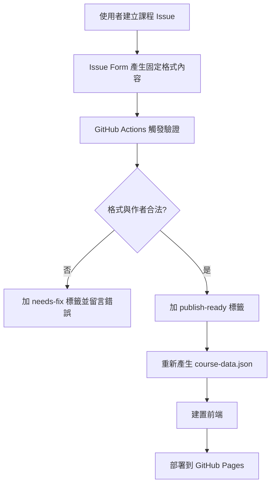

### 3.2 Issue 修改再驗證流程

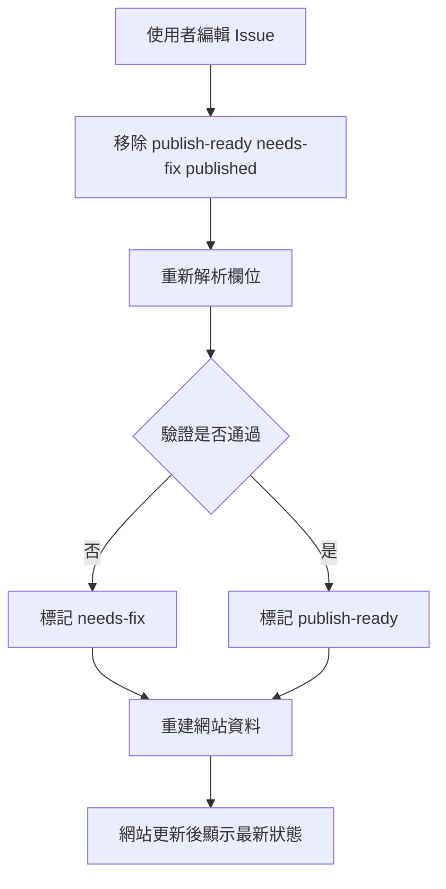

### 3.3 課程目錄發佈流程

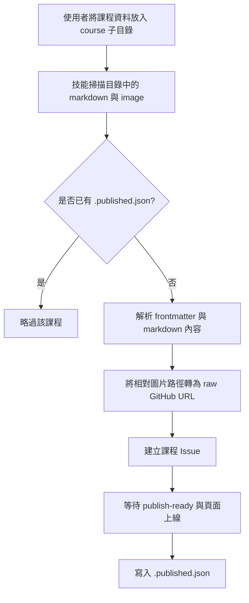

## 4. 虛擬碼

```text
function validateIssue(issue):
  if issue.author not in allowedPublishers:
    return invalid("作者不在白名單")

  parsed = parseIssueBody(issue.body)
  validate required fields
  validate datetime format
  validate endAt > startAt
  validate price is numeric
  validate signupUrl is valid URL
  validate imageUrl can be extracted

  if errors exist:
    return invalid(errors)

  return valid(parsedCourse)

function buildSiteData(issues):
  validatedCourses = []

  for each issue in issues:
    if issue is closed:
      continue
    if issue lacks publish-ready:
      continue
    result = validateIssue(issue)
    if result invalid:
      continue
    if result.parsedCourse.endAt <= now:
      continue
    validatedCourses.append(result.parsedCourse)

  sort validatedCourses by startAt asc
  featured = first item or null

  return {
    generatedAt,
    timezone,
    featuredCourseId: featured?.id,
    courses: validatedCourses
  }

function publishCourseDirectory(courseDir):
  if published record exists and not force:
    return skipped

  markdown = read course markdown
  metadata = parse frontmatter
  content = rewrite markdown image links to raw GitHub URLs
  payload = map metadata + markdown content to issue fields
  validate payload locally
  create issue
  wait for publish-ready and published
  write .published.json
```

## 5. 系統脈絡圖

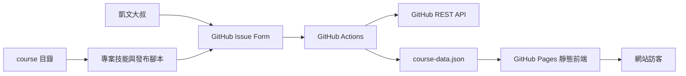

## 6. 容器/部署概觀

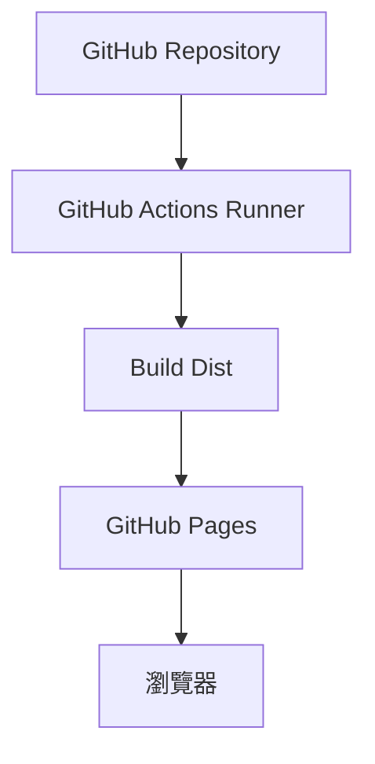

部署說明：
- 主分支推送會觸發完整建置與部署。
- Issue 事件也會觸發驗證、資料重建與部署。
- 部署輸出為 `dist/` 靜態資產。

## 7. 模組關係圖

### Frontend

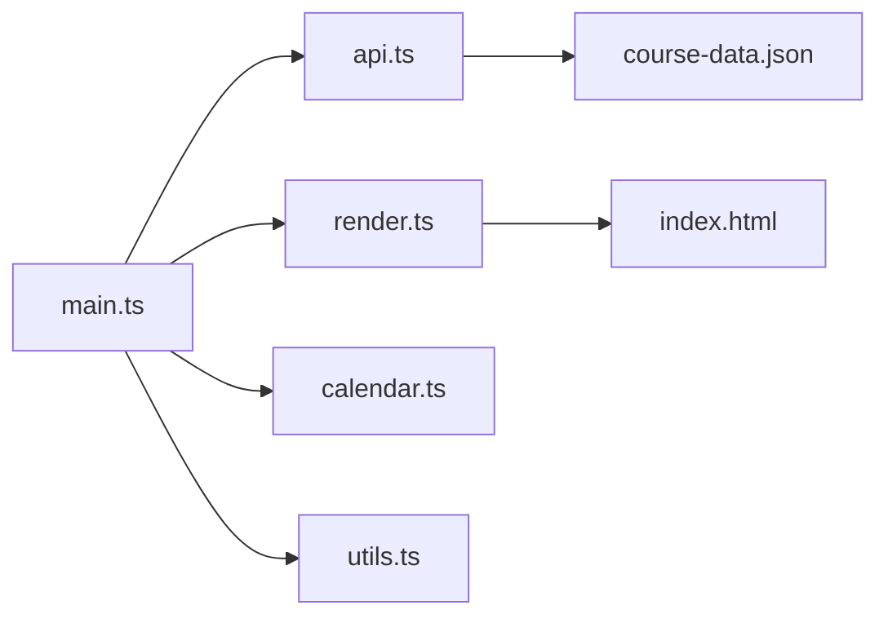

### Automation

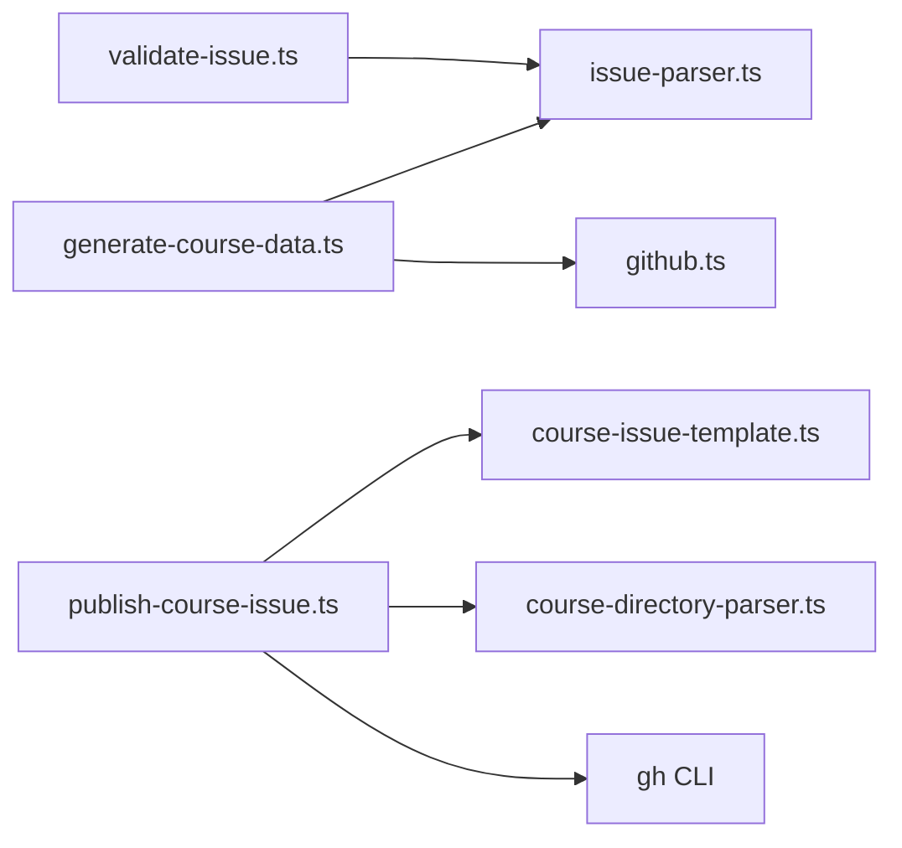

## 8. 序列圖

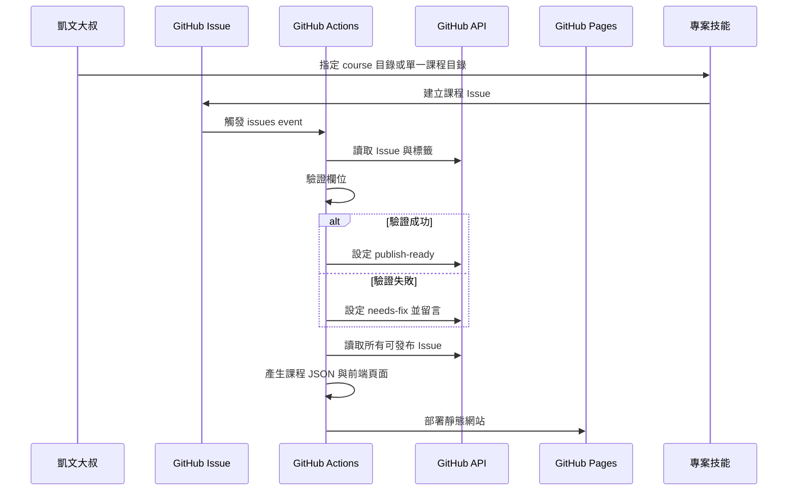

## 9. ER 圖

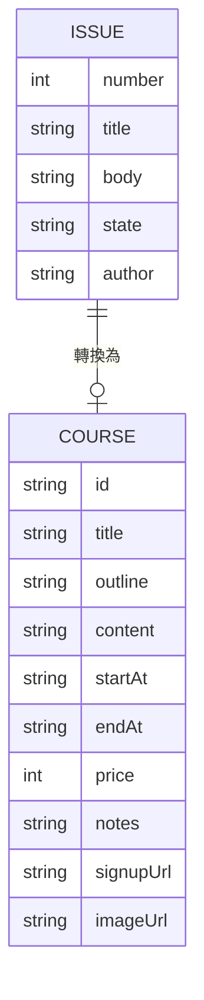

## 10. 類別圖（後端關鍵類別）

> 本案無獨立後端，以下為建置腳本中的核心類別與型別關係。

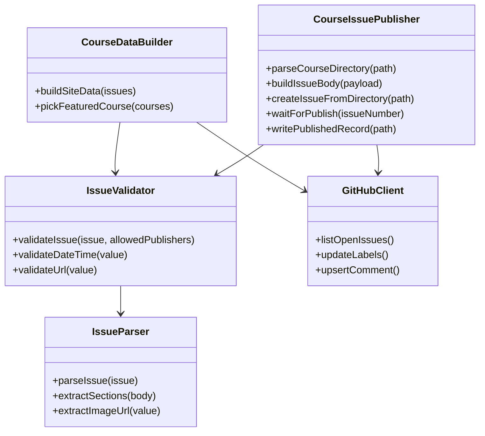

## 11. 流程圖

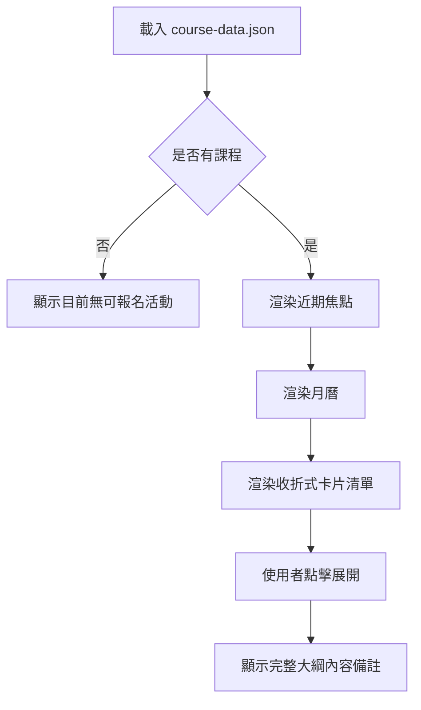

## 12. 狀態圖

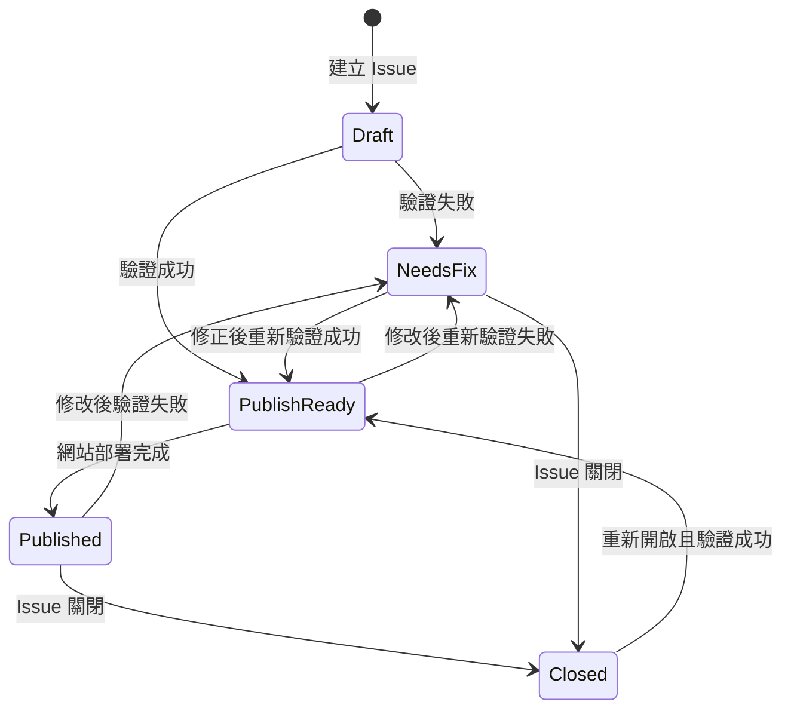

## 驗收標準

- 使用者只能透過固定 Issue Form 建立課程。
- 驗證成功的 Issue 會自動帶上 `publish-ready`。
- 驗證失敗的 Issue 會自動帶上 `needs-fix` 並附上錯誤說明。
- 已過期課程不出現在網站。
- 首頁包含近期焦點、月曆檢視與收折卡片清單。
- `price = 0` 時顯示 `免費`。
- 手機與桌機皆可正常閱讀與操作。
- 專案技能可從 `course` 目錄讀取尚未發布的課程，自動建立合法 Issue，並在課程目錄下寫入發布紀錄。
